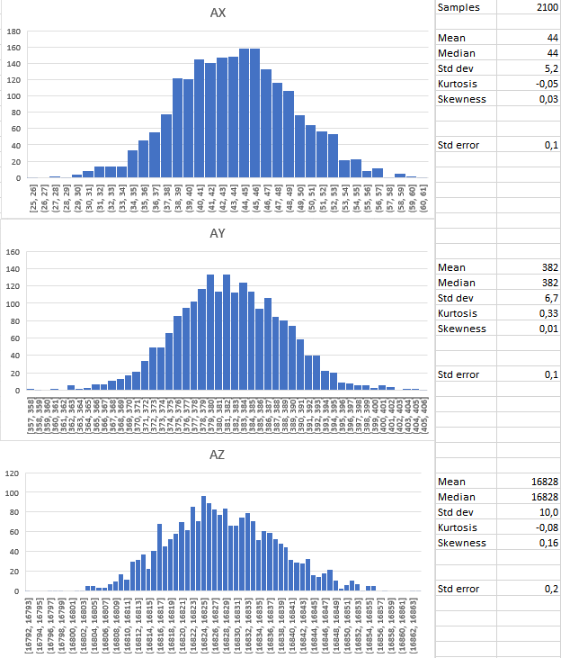
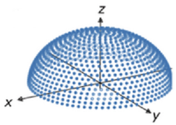
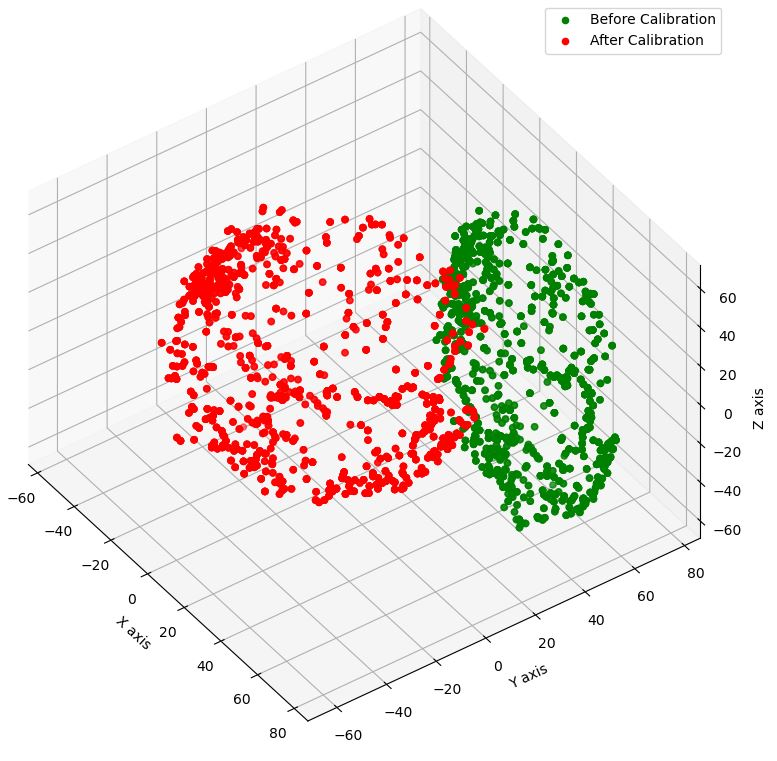

# IMU calibration

The car contains an inertial measurement unit (IMU), an LSM9DS1 9DoF MARG sensor (Magnetic, Angular Rate and Gravity), which needs to be calibrated. When booting, if there is no calibration data it will stop execution.
Calibration data is stored in a file, in the spiffs filesystem located in its own [partition](https://github.com/nostromo-1/robotic-car-ESP32/blob/master/partition%20tables.md).


Calibration can be entered in the boot sequence, by pressing the push button when the display says "CALIB?" and keeping it pressed until the text disappears. It will then display the text `HORIZ. WAIT`
on the display. You have to leave the car on a level surface, with no motion, during the initial part of the calibration; in the second part, you have to slowly rotate the car in all directions.

It will be performed in 3 steps, the firt two steps are the initial part of the calibration:
* Calibration of the accelerometer and gyroscope: During 10 seconds, while stationary on a level surface, it will continously read both instruments, and then calculate the mean value of the samples (which will be stored as the bias error) and their standard deviation (which will also be stored in a file)
* Sampling of the magnetometer: During 8 more seconds, and still with the car stationary and horizontal, it will read the magnetometer and calculate the standard deviation of the samples (and store them in a file)
* Calibration of the magnetometer: The text `ROTATE CAR...` will appear on the display, and the buzzer will briefly piep. Take the car, and slowly rotate it in all directions, over all 3 axis, for 30 seconds, until the buzzer pieps again. During this time, samples will be taken which will be used to calculate the hardiron and softiron correction parameters of the magnetometer.

After calibration is complete, it will store the results in 2 files:
* `calibration.dat` contains the offset bias of the accelerometer and gyroscope, and the hardiron and softiron parameters of the magnetometer
* `deviation.dat` contains the standard deviation of the samples of all 3 instruments

These files can be accessed over the built-in http server, if there is a wifi connection with DHCP server. Upon boot, the assigned IP address of the car will appear on the display. During car operation, type the following text in a browser connected to the same wifi network: `http://192.168.1.xx/spiffs/calibration.dat` or `http://192.168.1.xx/spiffs/deviation.dat`, using the IP address of your car.

## Accelerometer and gyroscope
The accelerometer reads the acceleration in each axis (X, Y and Z), and the gyroscope reads the angular velocity (rotational speed) in each axis.
These instruments are read continously during the calibration; each value is read for all 3 axis. The accelerometer should read zero in all 3 axis except the vertical (Z), where it should read the gravitatory force (which is undistinguisable from an acceleration, this is the equivalence principle, basis of the theory of relativity). The calibration assumes that the car is near the Earth surface and not on a satellite, and thus it assumes a 1g gravitation acceleration. The gyroscope should read zero in all 3 axis.

But instead of zero, some value will be read in each sample during calibration; this is the bias error, which will later (during operation) be substracted from the sampled values to obtain the real values. The calibration phase calculates these bias errors (one for each axis). The sampled values are not constant; instead, they are a random stochastic process, which can be modelled as gaussian noise around a certain value (its mean value).

This is an example of several samples taken from the accelerometer during calibration:


The histograms and statistical analysis of the shown samples can be seen here:



The conclusion from the above graphics and values is that the samples follow a normal distribution (or very close to it), and thus can be modelled as gaussian noise around its mean value $`\mu`$. This mean value is the bias error stored in the `calibration.dat` file for processing during operation. A similar conclusion is drawn when analysing the gyroscope samples.

As can be seen in the pictures, the standard deviation $`\sigma`$ of the samples is quite small, so that the values are centered around the mean value. The standard error of the mean, given the number of samples taken during calibration, is very small (0.1 or 0.2 in the above examples). Given this, the 95\% confidence interval of the calculated offset bias is rather small, and can be calculated as [1.96](https://en.wikipedia.org/wiki/97.5th_percentile_point) times the standard error, in each direction. So, in the above example, it would be $`44\pm0.22`$ for the X axis. This is a negligible error,so that the offset bias values are stored in integer format in the car.

## Magnetometer
A magnetometer reads the strength and direction of the surrounding magnetic field, providing a value for each axis. The car uses it to calculate the earth's magnetic field, and combine this with the accelerometer values in order to estimate its attitude (roll, pitch and yaw angles). Therefore, any surrounding magnetic field and any ferromagnetic material around the sensor affects the measurement. These errors can be compensated for if they are constant with respect to the sensor, like for example the effects of the car motors.

In absence of such perturbations, the magnetometer would read a magnetic field vector corresponding to the earth's magnetic field, which is different in each location (but is close to about 0.5 gauss or 50 uTeslas). You can check [here](https://www.magnetic-declination.com/) or [here](https://www.ngdc.noaa.gov/geomag/calculators/magcalc.shtml) the strength and direction of the field in your location.

The graphical representation of the magnetic field vector and its 3 components would be this:


If you rotate the car, and take samples repeteadly marking the 3D space point where the magnetic vector is, as the strength of the magnetic field does not change, you would end up with points on the surface of a sphere, centered at the origin:



However, due to the influence of external magnetic fields in the car (like metal parts and motors), the result will not be a sphere, but a displaced and stretched sphere, i.e., an ellipsoid not centered at the origin. Its 3 axis will be different (stretching) and the center will be displaced from the origin. The task of the calibration is to calculate the transformation needed to map each sample (taken during car operation) from the ellipsoid onto the sphere, thus correcting the distortions.


This is a complex task for a microcontroller with limited flash space, and a simplified approach has been taken. This approach assumes that the axis of the ellipsoid are parallel to the coordinate axis, which is normally the case; this assumption greatly simplifies the calculations: it means that the rotation matrix is diagonal, with only 3 parameters. So, for each sample value from the magnetometer, the following transformation would be applied: 
```math
\displaylines{x' = A\times (x-u) \\\ y' = B\times (y-v) \\\ z' = C\times (z-w)}
```

This means that we move the center of the ellipsoid and we multiply by a factor, in order to recreate the sphere. The task of the calibration is to calculate the unknowns: $`A, B, C, u, v, w`$. The displacement (or coordinates of the center of the ellipsopid) $`u, v, w`$ are the **hardiron** error, while the stretching factors $`A, B, C`$ are the **softiron** error.


